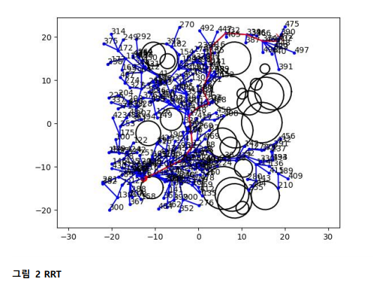
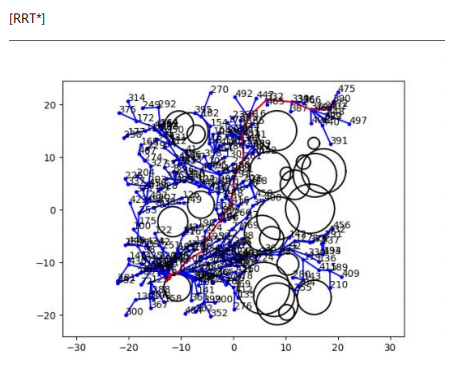

# Path planning, RRT, RRT*, RRT-Dubins

## Implementing Path planning in Frenet frame and controling with stanley method

* Path planning in Frenet frame in RVIZ.
  
* Longitudinal planning with quartic polynomial.
* Lateral planning with Quintic polynomial.

<<<<<<< HEAD
=======

* Value each planned path with custom cost function and choose the best one.

## Implementing RRT

  
## Implementing RRT*

  
## Implementing RRT-Dubins
* Used Dubins path to connect between nodes.

>>>>>>> 5295aacf592c60538242ef50f82518343802d076
