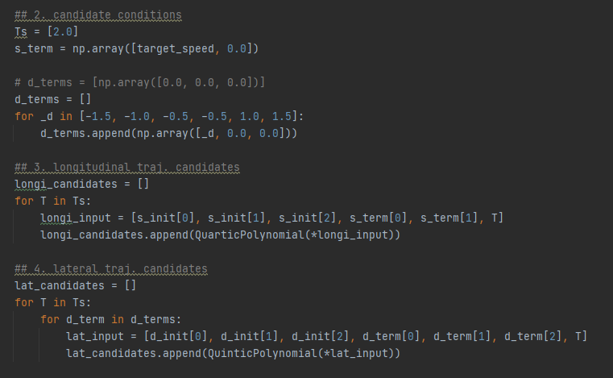
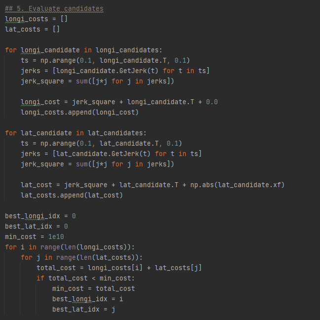

# Path planning in RVIZ

## Implementing Path planning in Frenet frame and controling with stanley method

* Path planning in Frenet frame in RVIZ.
  
* Longitudinal planning with quartic polynomial.
* Lateral planning with Quintic polynomial.

* Value each planned path with custom cost function and choose the best one.

